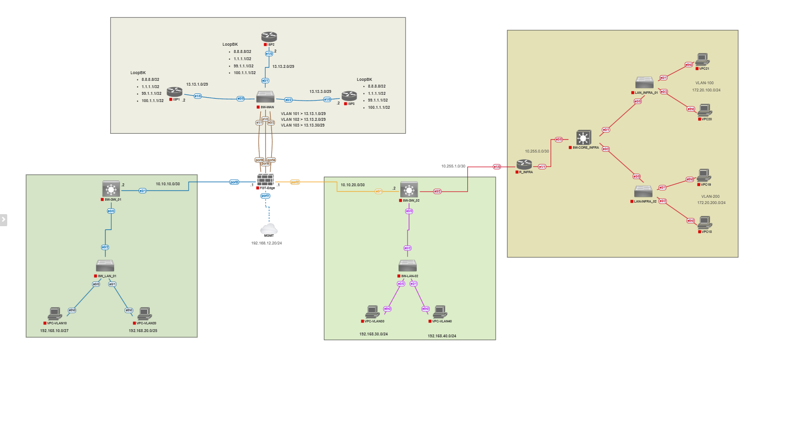

# FortiGate Multi-ISP Static Route Lab

A hands-on lab built in **PNetLab**, simulating a FortiGate firewall connected to the internet through **3 independent ISPs**, with static routing, route prioritization, and firewall policy configuration.

## 🎯 Objective

The goal of this lab is to design and configure a resilient internet edge using a single FortiGate firewall with **3 separate ISP connections**. The current phase focuses on basic connectivity and policy setup, with planned enhancements for:

- Route prioritization using **administrative distance** and other route metrics
- **Automatic failover**: if one ISP link goes down, traffic should seamlessly shift to the remaining active ISPs, ensuring continuous internet access

This simulates a real-world enterprise requirement: high availability of internet connectivity through ISP redundancy.

## 🗺️ Topology

The lab simulates 3 independent ISP connections to a single FortiGate firewall, with internal network access routed through the firewall.

## ⚙️ What Was Configured

- **Static Routes** — routes to reach the internet through each of the 3 ISP connections
- **Firewall Policies** — security policies controlling traffic flow between internal network and internet zones
- **Internet Simulation** — simulated ISP/internet segments to emulate real upstream connectivity
- **Loopback Interfaces** — used for testing reachability and route verification independent of physical interface state

## 📁 Repository Contents

| File | Description |
|---|---|
| `lab01-fgt-static-route.unl` | PNetLab topology export file — import this to recreate the lab environment |
| `topology-diagram.png` | Visual diagram of the network topology |
| `fortigate-config.txt` | FortiGate CLI configuration (static routes, firewall policies, interfaces) |

## 🔜 Planned Improvements

- [ ] Configure route **administrative distance** to set ISP priority (primary/backup links)
- [ ] Implement and test **failover behavior** — verify traffic reroutes correctly when the primary ISP link fails
- [ ] Add **SD-WAN** or **link monitoring** for automated, faster failover detection
- [ ] Document failover test results (before/after link-down scenarios)

## 🛠️ Tools Used

- **PNetLab** — network emulation platform
- **FortiGate (FortiOS)** — firewall/router
- **VMware** — virtualization host for PNetLab

## 📚 About This Project

This lab is part of a structured, hands-on learning path toward **Cloud Security Engineering**, building practical networking and firewall skills through progressively complex enterprise scenarios.

---

*Part of a personal network security lab series.*
